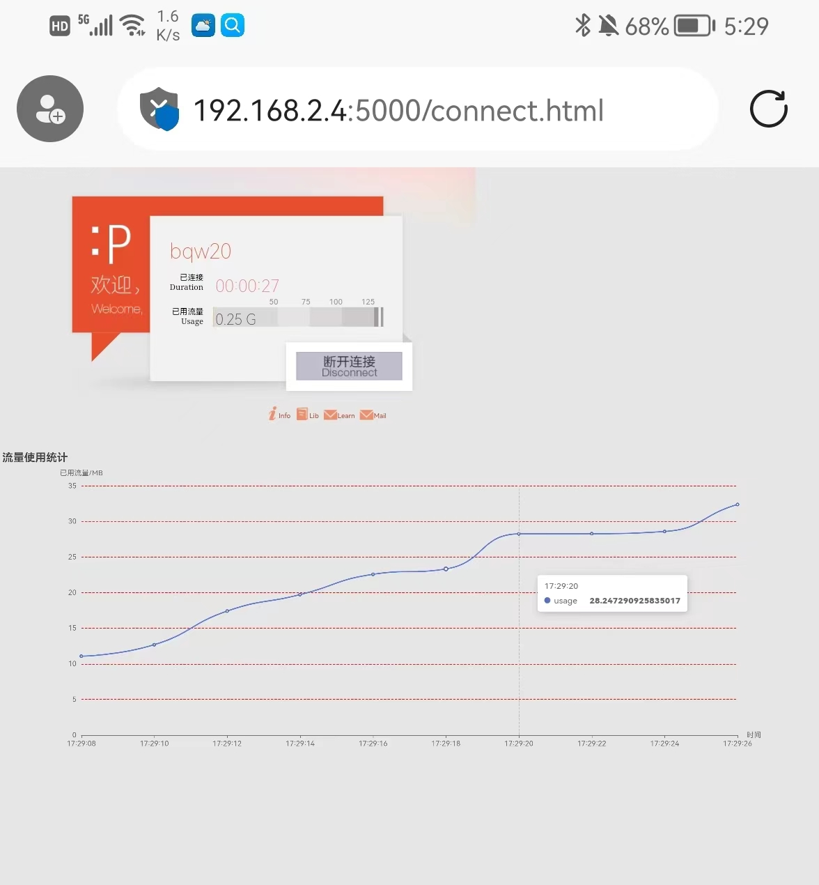

# Web前端 基础实验3

> 姓名：贲清炜
> 
> 学号：2020013061
> 
> 邮箱：bqw20@mails.tsinghua.edu.cn

## 运行步骤

* 在命令行中打开fakewifi文件夹
* 依次在命令行中执行
  * npm install
  * npm run build
  * pip install -r requirements.txt
  * python backend/app.py
* 在浏览器端打开localhost:5000
* 移动端打开方式：
  * 首先查询到电脑的IPV4地址，如192.168.2.4，在后面加上:5000即可在手机的浏览器上访问，总链接示例：http://192.168.2.4:5000（要求手机和电脑在同一个局域网）

## 项目内容

### 前端页面

* 在第二次作业的基础上实现本次作业内容

* 表格实现在连接之后的页面，因此需要首先在第一个页面登陆

* 登录可以通过两个账号实现，分别为：
  
  * 用户名：bqw20
    * 密码：123456
  * 用户名：lizy14
    * 密码：123456

* 电脑端显示结果移动端显示结果

    

* 

* 两端的兼容性良好，在小尺寸屏幕中不影响内容的观看

## 解决思路

* 实验实现方式
  * 利用Apache Echart实现了本次表格
  * 参考了如下网址的代码（Echart文档）
    * [Handbook - Apache ECharts](https://echarts.apache.org/handbook/en/how-to/data/dynamic-data)[Handbook - Apache ECharts](https://echarts.apache.org/handbook/en/how-to/data/dynamic-data)
  * 在vue中利用methods和mounted实现了表格对应的一系列函数
  * 通过setInterval()实现了每2s的刷新
  * 通过Math.random()函数实现每2s中数值的增加
  * 通过js对于数字和字符串可以直接相加的属性，实现了时间的每一位都是两位的性质。通过Date类的属性直接获取了运行时的时间。
  * tooltip中设置trigger: 'axis';使图表在鼠标悬停时显示出竖直虚线
  * 折线图通过设置series中的type:"line";实现，同时自带了鼠标悬停显示数值的功能
  * yAxis中设置LineStyle相应属性实现了水平虚线